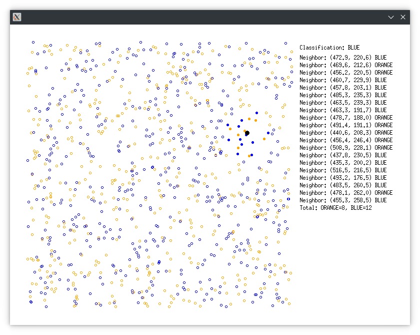

# SIMD KNN

Simple 2D KNN with basic SIMD and X11 UI. One day mini-project.



## Notes

I wrote this to runtime check for FMA support, but decided against its use as only MSVC fails to support `__FMA__` macro.

```cpp
bool is_fma_supported() {
    unsigned int eax, ebx, ecx, edx;

    asm volatile(
        "cpuid"
        : "=a"(eax), "=b"(ebx), "=c"(ecx), "=d"(edx)
        : "a"(1), "c"(0)
    );

    return (ecx & (1 << 12)) != 0;
}
```
